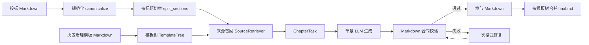

# Phase 1 Architecture

## 目标边界

本阶段只实现火区治理施工组织设计的文本生成闭环：

1. 输入一份火区治理投标技术文件 Markdown。
2. 将输入规范化为稳定 Markdown，并按标题层级切成可检索章节。
3. 读取火区治理施组模板目录树与小章节填充约束。
4. 为每个模板小章节召回投标文档中的相关片段。
5. 逐小章节生成独立 Markdown 草稿。
6. 对 LLM 输出执行格式合同校验，失败时走一次修复。
7. 全部小章节通过后，按模板目录顺序合并为完整 `final.md`。
8. 用简要前端展示项目输入、模板树、章节来源、单章结果、生成日志和合并结果。

本阶段暂不实现图纸生成、方案审查、Word/PDF 套版导出、权限管理、知识库后台、历史版本对比、消息通知和内网安全加固，但代码结构为这些能力预留端口。

## 与需求规格说明书的对应关系

需求规格说明书中的完整系统包括方案生成、智能审查、知识库管理、用户反馈、权限、安全与部署等模块。当前原型只覆盖“场景一：施工方案智能生成”的最小文本闭环，并刻意降低输入复杂度：第一阶段只接受 Markdown，不处理 PDF/Word/CAD/OCR。

已覆盖的关键点：

- 逐章或全量生成的架构基础：每个 `TemplateNode` 独立生成 `chapter_node_id.md`。
- 模板驱动：模板树与生成 pipeline 解耦，后续可替换为光伏、风电、市政等模板。
- 来源可追溯：章节任务保存召回来源，API 和前端展示来源片段。
- 输出受控：`MarkdownContractValidator` 检查标题、固定模块、JSON 输出、来源摘要、人工补充占位和疑似编造参数。
- 可替换 LLM：业务层依赖 `LLMClient` 端口，当前默认 fake LLM，后续接私有化或 OpenAI-compatible 服务。

暂未覆盖但已预留的方向：

- 审查模块：可在 `domain/validation.py`、`application/validate_chapter.py` 之外新增审查领域模型和 use case。
- 知识库：`ports/retriever.py` 已抽象检索接口，`hybrid_retriever.py` 为向量和关键词混合检索预留。
- 异步任务：`ports/task_queue.py` 预留队列接口；当前 API 同步执行，便于演示。
- Word/PDF 导出：当前仅输出 Markdown，后续可在 artifacts 层增加渲染器。
- 权限和隔离：当前本地原型无用户体系，后续需在 API 层引入认证、项目权限和审计日志。

## 分层设计

```text
domain          纯领域模型，不依赖 FastAPI、文件系统或 LLM
application     用例编排：摄取、匹配、生成、校验、合并
ports           抽象接口：LLM、存储、模板、解析、检索、队列
infrastructure  具体实现：本地存储、Markdown、模板、检索、LLM
interfaces      API 和 CLI 入口
web             简要前端演示
```

## 主要数据流



## 输出合同

每个小章节的 LLM 输出必须是 Markdown，并包含：

```markdown
# 小章节标题

## 主要来源摘要

## 生成正文

## 人工补充需补充
```

原则：

- 不输出 JSON。
- 不新增模板外的大章节。
- 不把缺失的合同、坐标、工程量、监测、审批、最终参数写成确定事实。
- 缺失项必须保留 `【需人工补充：...】` 占位。
- 有来源片段时必须列出来源摘要。

## 第一阶段验收证据

- Python 编译：`python -m compileall -q src`
- 后端测试：`python -m unittest discover -s tests`
- CLI 演示：`python -m coalplan.interfaces.cli.generate_demo`
- 前端构建：在 `src/coalplan/web` 下执行 `npm run build`
- API 闭环：创建项目、上传 Markdown、生成、合并、读取 `final.md`
